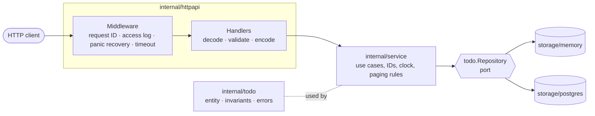
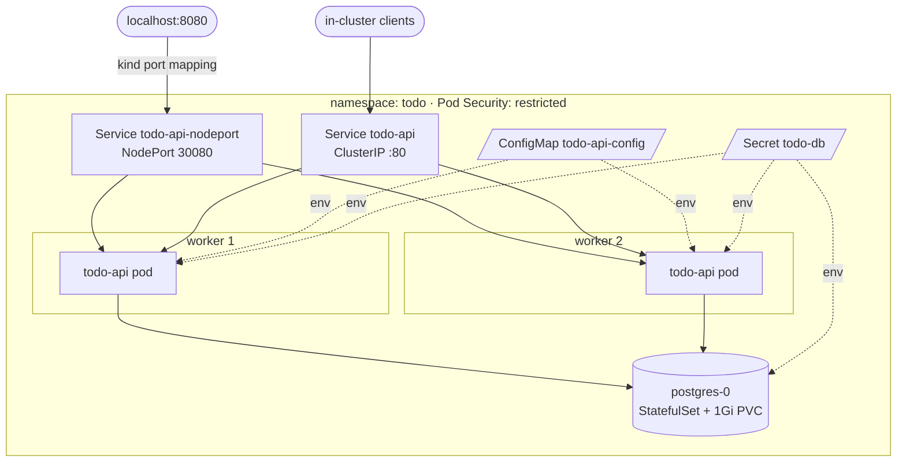

# todo-service

[](https://github.com/mirza76/todo-service/actions/workflows/ci.yml)

A ToDo REST microservice in Go, built to production standards: containerized
with Docker, deployed to Kubernetes with Kustomize, backed by PostgreSQL, and
designed to survive restarts, rollouts, and pod failures without dropping
requests.

> **Demo video:** _[link to be added]_

---

## Contents

- [Highlights](#highlights)
- [Architecture](#architecture)
- [API specification](#api-specification)
- [Quick start](#quick-start)
- [Configuration](#configuration)
- [Docker](#docker)
- [Kubernetes deployment](#kubernetes-deployment)
- [Testing](#testing)
- [Design decisions](#design-decisions)
- [Known limitations](#known-limitations)
- [Future improvements](#future-improvements)

---

## Highlights

| Area | What it does |
|---|---|
| **API** | RESTful CRUD on `/todos` with full (PUT) and partial (PATCH, JSON Merge Patch) updates, filtering, offset pagination, correct status codes, `Location` on create, [RFC 9457](https://www.rfc-editor.org/rfc/rfc9457) `application/problem+json` errors with per-field validation details |
| **Architecture** | Layered / hexagonal: HTTP → service → `Repository` port → adapters (in-memory, PostgreSQL). Standard library router, minimal dependencies |
| **Data** | PostgreSQL shared by all replicas; embedded migrations made safe for concurrent replica startup with an advisory lock |
| **Observability** | Structured JSON logs (`log/slog`), one access-log line per request, `X-Request-ID` correlation across response headers, error bodies, and every log line |
| **Resilience** | Graceful shutdown with a readiness drain (measured: **0 failed requests** during rolling restarts), DB connect retry with exponential backoff, per-request timeouts, panic recovery, server timeouts |
| **Health** | `/livez` (process only) and `/readyz` (dependencies + shutdown state), wired to startup, liveness, and readiness probes |
| **Docker** | Multi-stage build, static binary, distroless non-root image (~21 MB), BuildKit caching |
| **Kubernetes** | 2 replicas spread across nodes, requests/limits, PodDisruptionBudget, ConfigMap + Secret, `restricted` Pod Security Standard, read-only root filesystem, no service-account token |
| **CI** | GitHub Actions: lint, race-enabled tests incl. PostgreSQL integration, `govulncheck`, Docker build + smoke test; actions pinned to commit SHAs, read-only token |
| **Quality** | Unit, handler, and integration tests (real PostgreSQL via Testcontainers), one shared contract suite for every storage adapter, race detector, 17 linters, end-to-end smoke test with failure drills |

---

## Architecture

### Layers



Dependencies point inward. `internal/todo` (the domain) imports nothing from
the project. The service depends only on the `Repository` interface, and
storage adapters are chosen at startup in `cmd/todo-api/main.go`, the only
place where concrete types are wired together.

### Project layout

```
cmd/todo-api/            Entry point: config, wiring, server lifecycle, graceful shutdown
internal/
  config/                Environment configuration, validated at startup (fail fast)
  todo/                  Domain: Todo entity, title rules, errors, Repository port
  service/               Use cases: create, get, list, replace, delete
  httpapi/               Routing, handlers, DTOs, JSON decoding, problem+json, middleware
  health/                Liveness and readiness handlers
  requestid/             X-Request-ID middleware and log correlation
  storage/
    memory/              In-memory adapter (local development, tests)
    postgres/            PostgreSQL adapter + embedded SQL migrations
    storagetest/         Contract test suite run against every adapter
deploy/
  k8s/base/              Environment-agnostic app manifests
  k8s/components/postgres/  Optional in-cluster PostgreSQL (StatefulSet + PVC)
  k8s/overlays/dev/      kind overlay: base + postgres + dev Secret + NodePort
  kind/cluster.yaml      Local 3-node cluster definition
docs/adr/                Architecture Decision Records
scripts/smoke.sh         End-to-end test with failure drills
```

### Kubernetes topology (dev overlay)



---

## API specification

Base URL: `http://localhost:8080`. All request and response bodies are JSON.

### Endpoints

| Method | Path | Description | Success |
|---|---|---|---|
| `GET` | `/todos` | List todos (filtered, paginated) | `200 OK` |
| `POST` | `/todos` | Create a todo | `201 Created` + `Location` header |
| `GET` | `/todos/{id}` | Get one todo | `200 OK` |
| `PUT` | `/todos/{id}` | Replace a todo (all fields required) | `200 OK` |
| `PATCH` | `/todos/{id}` | Partially update a todo | `200 OK` |
| `DELETE` | `/todos/{id}` | Delete a todo | `204 No Content` |
| `GET` | `/livez` | Liveness probe | `200 OK` |
| `GET` | `/readyz` | Readiness probe | `200 OK` / `503` |

### Todo resource

```json
{
  "id": "01a108e6-e9ad-74fd-bbc8-8b4c524ee2ca",
  "title": "Buy milk",
  "completed": false,
  "created_at": "2026-10-05T09:30:00.123456Z",
  "updated_at": "2026-10-05T09:30:00.123456Z"
}
```

| Field | Type | Notes |
|---|---|---|
| `id` | string (UUIDv7) | Server-generated, time-ordered |
| `title` | string | Required. Surrounding whitespace is trimmed; 1–200 characters; no control characters |
| `completed` | boolean | Optional on create (defaults to `false`), required on replace, optional on patch |
| `created_at` | string (RFC 3339, UTC) | Set on create, never changes |
| `updated_at` | string (RFC 3339, UTC) | Updated on every change |

### Requests

**Create:** `POST /todos`
```json
{ "title": "Buy milk", "completed": false }
```

**Replace:** `PUT /todos/{id}`. PUT replaces the whole resource, so both fields are required:
```json
{ "title": "Buy oat milk", "completed": true }
```

**Partial update:** `PATCH /todos/{id}` follows
[JSON Merge Patch (RFC 7396)](https://www.rfc-editor.org/rfc/rfc7396). Send
only the fields to change; the rest stay as they are. Accepts
`Content-Type: application/json` or `application/merge-patch+json`.
```json
{ "completed": true }
```
- An empty patch `{}` changes nothing and does not bump `updated_at`.
- `null` means "remove the field" in merge patch. Neither field can be
  removed, so `null` is rejected with `422`.
- The merged result is validated with the same rules as create and replace.

**List:** `GET /todos?completed=false&limit=20&offset=0`

| Query parameter | Default | Rules |
|---|---|---|
| `completed` | (none) | `true` or `false`, exactly; filters by status |
| `limit` | `20` | Integer, 1–100 |
| `offset` | `0` | Integer, ≥ 0 |

Results are ordered by `created_at`, then `id`, so pages are stable. `total`
counts the todos that match the filter.

```json
{
  "items": [ { "id": "…", "title": "Buy milk", "completed": false, "created_at": "…", "updated_at": "…" } ],
  "total": 42,
  "limit": 20,
  "offset": 0
}
```

### Errors

Every error, including unknown routes and wrong methods, uses
[RFC 9457](https://www.rfc-editor.org/rfc/rfc9457) Problem Details with
`Content-Type: application/problem+json`:

```json
{
  "type": "about:blank",
  "title": "Unprocessable Entity",
  "status": 422,
  "detail": "The request contains invalid fields.",
  "instance": "/todos",
  "errors": [ { "field": "title", "message": "must not be empty" } ],
  "request_id": "0f5f1d0e-8b1c-4a8e-9a43-3c3f0b9a7d21"
}
```

### Request IDs

Every response carries an `X-Request-ID` header, and every error body
includes the same value as `request_id`. If a client sends a well-formed
`X-Request-ID` (1–128 characters of `A–Z a–z 0–9 - _ . :`), it is reused so a
request can be traced across services. Otherwise a new UUID is generated. The
ID is added to **every log line** written while handling the request (access
log, errors, panics), so one ID finds everything about a request:

```bash
kubectl --context kind-todo -n todo logs -l app.kubernetes.io/name=todo-api | grep '"request_id":"<id>"'
```

| Status | When |
|---|---|
| `400 Bad Request` | The request can't be parsed: malformed JSON, body not a JSON object, wrong JSON type, unknown field, trailing data, non-integer `limit`/`offset`, `completed` not `true`/`false` |
| `404 Not Found` | Unknown todo ID, malformed ID, or unknown route |
| `405 Method Not Allowed` | Route exists but not for this method (includes an `Allow` header) |
| `413 Content Too Large` | Body exceeds `HTTP_MAX_BODY_BYTES` |
| `415 Unsupported Media Type` | `Content-Type` is not `application/json` (PATCH also accepts `application/merge-patch+json`) |
| `422 Unprocessable Entity` | Well-formed but breaks a rule: missing required field, `null` in a patch, invalid title, `limit` out of range. Lists every invalid field |
| `500 Internal Server Error` | Unexpected failure. Details are logged, never returned to the client |
| `503 Service Unavailable` | The request exceeded `HTTP_REQUEST_TIMEOUT` |

### Examples

```bash
# Create
curl -i -X POST localhost:8080/todos \
  -H 'Content-Type: application/json' \
  -d '{"title":"Buy milk"}'

# List (second page of 10)
curl 'localhost:8080/todos?limit=10&offset=10'

# List only open todos
curl 'localhost:8080/todos?completed=false'

# Get
curl localhost:8080/todos/<id>

# Replace
curl -X PUT localhost:8080/todos/<id> \
  -H 'Content-Type: application/json' \
  -d '{"title":"Buy oat milk","completed":true}'

# Mark as done (partial update)
curl -X PATCH localhost:8080/todos/<id> \
  -H 'Content-Type: application/json' \
  -d '{"completed":true}'

# Delete
curl -i -X DELETE localhost:8080/todos/<id>
```

---

## Quick start

**Prerequisites:** Go 1.27+. For containers and Kubernetes you also need
Docker (with BuildKit/buildx), [kind](https://kind.sigs.k8s.io/), `kubectl`,
`curl`, and `jq`. `golangci-lint` v2 is optional (for `make lint`).

Run `make help` to list every target.

### Run locally (in-memory storage)

```bash
make run
```

The API listens on `:8080` with in-memory storage, so data is lost on exit.

### Run locally with PostgreSQL (Docker Compose)

```bash
docker compose up --build
```

This starts PostgreSQL and the API on `localhost:8080`. Data persists in a
named volume. Remove everything, including the data, with
`docker compose down -v`.

---

## Configuration

All configuration comes from environment variables
([twelve-factor](https://12factor.net/config)). Invalid values are all
reported together at startup and the process exits, rather than running
misconfigured.

| Variable | Default | Description |
|---|---|---|
| `PORT` | `8080` | HTTP listen port |
| `LOG_LEVEL` | `info` | `debug`, `info`, `warn`, `error` (JSON logs to stdout) |
| `STORAGE_DRIVER` | `memory` | `memory` or `postgres` |
| `HTTP_READ_HEADER_TIMEOUT` | `5s` | Max time to read request headers (Slowloris protection) |
| `HTTP_READ_TIMEOUT` | `10s` | Max time to read the full request |
| `HTTP_WRITE_TIMEOUT` | `15s` | Max time to write the response |
| `HTTP_IDLE_TIMEOUT` | `60s` | Keep-alive idle timeout |
| `HTTP_REQUEST_TIMEOUT` | `5s` | Per-request processing deadline; must be shorter than `HTTP_WRITE_TIMEOUT` |
| `HTTP_MAX_BODY_BYTES` | `1048576` | Max request body size |
| `SHUTDOWN_DELAY` | `5s` | How long to keep serving after turning not-ready on SIGTERM |
| `SHUTDOWN_TIMEOUT` | `15s` | Max time to drain in-flight requests |
| `DB_HOST` | — | PostgreSQL host (required for `postgres`) |
| `DB_PORT` | `5432` | PostgreSQL port |
| `DB_NAME` | — | Database name (required for `postgres`) |
| `DB_USER` | — | Username (required for `postgres`) |
| `DB_PASSWORD` | — | Password (required for `postgres`) |
| `DB_SSLMODE` | `disable` | PostgreSQL `sslmode` |
| `DB_MAX_CONNS` | `10` | Connection pool size per replica |
| `DB_CONNECT_TIMEOUT` | `30s` | How long startup retries the database before exiting |

In Kubernetes, non-sensitive values come from the `todo-api-config`
ConfigMap and credentials from the `todo-db` Secret.

---

## Docker

The [Dockerfile](Dockerfile) has two stages:

1. **Build:** the official `golang:1.27-alpine` image compiles a static
   binary (`CGO_ENABLED=0`, `-trimpath`, `-s -w`). BuildKit cache mounts keep
   rebuilds fast, and the build runs natively on the host platform while
   cross-compiling for the target.
2. **Runtime:** `gcr.io/distroless/static-debian13:nonroot`, which contains no
   shell or package manager and runs as UID 65532. The final image is ~21 MB.

The binary is PID 1 (exec-form `ENTRYPOINT`), so it receives `SIGTERM`
directly and shuts down gracefully.

```bash
# Build (tags todo-api:<git-version> and todo-api:latest)
make docker-build

# Run with in-memory storage on localhost:8080
make docker-run

# Or with plain docker
docker build -t todo-api .
docker run --rm -p 8080:8080 todo-api
```

---

## Kubernetes deployment

### Manifests

Manifests use [Kustomize](https://kustomize.io/), which is built into `kubectl`:

| Path | Contents |
|---|---|
| [`deploy/k8s/base`](deploy/k8s/base) | Namespace (`restricted` Pod Security), ServiceAccount (no token), **Deployment** (2 replicas, requests/limits, startup/liveness/readiness probes, hardened security context, topology spread), **Service** (ClusterIP), PodDisruptionBudget, **ConfigMap** (generated) |
| [`deploy/k8s/components/postgres`](deploy/k8s/components/postgres) | PostgreSQL StatefulSet with a **PersistentVolumeClaim** and a headless Service. Optional: production would use a managed database instead |
| [`deploy/k8s/overlays/dev`](deploy/k8s/overlays/dev) | base + postgres component + dev **Secret** + NodePort for kind + `LOG_LEVEL=debug` |

The ConfigMap and Secret are generated with a content-hash suffix, so
changing a value automatically triggers a rolling restart.

### Deploy to a local kind cluster

```bash
make kind-up    # 3-node cluster: 1 control plane + 2 workers
make deploy     # build image, load into kind, apply manifests, wait for rollout
make smoke      # end-to-end test incl. failure drills
```

The API is then reachable at `http://localhost:8080`, with kind forwarding
it to the NodePort Service, which load-balances across both replicas.

```bash
kubectl --context kind-todo -n todo get pods -o wide
kubectl --context kind-todo -n todo logs -l app.kubernetes.io/name=todo-api -f
```

Clean up:

```bash
make undeploy   # remove the app and its data
make kind-down  # delete the cluster
```

> **On the very first deploy**, one API pod may restart once. A fresh
> PostgreSQL needs roughly 30–40 s to pull its image and initialize, which
> can exceed `DB_CONNECT_TIMEOUT`. The API then exits with a clear error and
> Kubernetes restarts it. This fail-fast behavior is intentional; see
> [ADR 0005](docs/adr/0005-health-checks-and-graceful-shutdown.md).

### Deploying to another cluster

Create an overlay that references `deploy/k8s/base`, sets the image
(`images:`), points `DB_HOST` at your database, and provides a `todo-db`
Secret with `username` and `password` keys from your secret manager. Leave
out the postgres component when you use a managed database.

---

## Testing

```bash
make test        # all tests, race detector on, incl. PostgreSQL integration tests (needs Docker)
make test-unit   # unit tests only, no Docker needed
make cover       # coverage summary across packages
make lint        # golangci-lint (17 linters incl. gosec, errorlint, contextcheck)
make smoke       # end-to-end against the kind deployment
```

| Level | What it covers |
|---|---|
| **Domain and service** | Title rules, timestamps, ID generation, pagination bounds, error wrapping |
| **Storage contract** | [`storagetest`](internal/storage/storagetest/storagetest.go) defines the `Repository` behavior once (not-found, duplicates, immutable `created_at`, stable ordering, pagination, context cancellation) and runs it against **both** adapters. PostgreSQL runs in a real container via Testcontainers |
| **Migrations** | Idempotent re-runs; 5 concurrent "replicas" migrating a fresh database: exactly one applies the schema |
| **HTTP** | Every endpoint and every error status, including malformed JSON, oversized bodies, 405 with `Allow`, panics, timeouts, and that internal errors are not leaked |
| **Lifecycle** | Graceful shutdown on a real TCP listener: readiness turns 503, in-flight requests complete, the listener closes |
| **End-to-end** | [`scripts/smoke.sh`](scripts/smoke.sh): CRUD, errors, consistency across replicas, and failure drills under continuous load |

Example smoke test result on kind:

```
== Drill A: delete one API pod under load
  ✓ pod deletion: 86 requests, 0 failed
== Drill B: rolling restart under load
  ✓ rolling restart: 126 requests, 0 failed
== Drill C: restart PostgreSQL, data must survive
  ✓ data intact after DB restart
All 26 checks passed.
```

---

## Design decisions

The key decisions are summarized here. Each one has a short
[Architecture Decision Record](docs/adr) with context and trade-offs.

### 1. PostgreSQL, because the spec requires 2 replicas ([ADR 0002](docs/adr/0002-postgresql-for-shared-state.md))

The challenge suggests in-memory storage or an embedded store such as BoltDB,
and also asks for **2 replicas**. These conflict:

- **In-memory:** each replica has its own data. A todo created through
  replica A is missing when the next request lands on replica B.
- **BoltDB + PVC:** BoltDB takes an exclusive file lock, and typical
  `ReadWriteOnce` volumes can't be shared, so the second replica can't open the
  database.

So the service stores data behind a `Repository` interface with two adapters:
**in-memory** for local development and tests, and **PostgreSQL** as the
shared store used in Kubernetes. The smoke test checks this: 20 load-balanced
reads after a write all see the new todo.

### 2. Graceful shutdown with a readiness drain ([ADR 0005](docs/adr/0005-health-checks-and-graceful-shutdown.md))

When Kubernetes terminates a pod, removing it from Service endpoints and
sending `SIGTERM` happen **in parallel**, so traffic can still arrive briefly
after the signal. On `SIGTERM` the service:

1. Reports `503` on `/readyz`.
2. **Keeps serving for `SHUTDOWN_DELAY` (5 s)** while endpoint removal
   propagates.
3. Stops accepting connections and drains in-flight requests (up to
   `SHUTDOWN_TIMEOUT`, 15 s).

5 s + 15 s fits inside `terminationGracePeriodSeconds: 30`. The delay is
implemented in the app rather than as a `preStop` hook because the distroless
image has no `sleep` binary.

**Measured:** a rolling restart under continuous load had **0 failed
requests** with the delay. With `SHUTDOWN_DELAY=0s`, the same test **failed
2 of 153 requests** (connection refused).

### 3. Separate liveness and readiness

- **`/livez`** checks only that the process can serve. It deliberately ignores
  the database: restarting the app wouldn't fix a database outage and could
  cause a restart storm.
- **`/readyz`** pings PostgreSQL (with a 2 s timeout) and turns not-ready
  during shutdown, so only pods that can do useful work receive traffic.
- **`startupProbe`** allows up to 60 s for the initial database connection
  and migrations before liveness checks begin.

### 4. Migrations that are safe with concurrent replicas ([ADR 0003](docs/adr/0003-embedded-migrations-with-advisory-lock.md))

SQL migrations are embedded in the binary and applied at startup inside **one
transaction holding a PostgreSQL advisory lock**. When both replicas start
together, one applies the schema and the other waits, then finds nothing to
do. PostgreSQL DDL is transactional, so a failed migration leaves no partial
schema behind.

### 5. API semantics ([ADR 0004](docs/adr/0004-error-model-and-status-codes.md))

- **PUT is a full replacement** (RFC 9110), so `title` and `completed` are both
  required. **PATCH is a partial update** using JSON Merge Patch (RFC 7396).
  The body is decoded in two passes: a strict typed pass for precise errors,
  and a raw pass to tell an absent field (leave unchanged) from an explicit
  `null` (rejected).
- **400 vs 422:** 400 means the request can't be parsed; 422 means it parsed
  but breaks a rule. Clients can tell "fix your encoding" apart from "fix your
  data".
- **A malformed ID returns 404**, not 400: an ID that can't exist identifies
  no resource, and clients don't need to know the ID format.
- **Errors never leak internals.** Unexpected errors are logged with full
  detail; the client gets a generic 500.

### 6. Minimal dependencies, standard library first ([ADR 0001](docs/adr/0001-layered-architecture-and-stdlib.md))

Routing uses Go's `net/http.ServeMux` (method and path-parameter patterns
since Go 1.22), logging uses `log/slog`, and configuration uses `os.LookupEnv`.
The only runtime dependencies are `pgx` (PostgreSQL) and `google/uuid`.

### 7. IDs and pagination ([ADR 0006](docs/adr/0006-uuidv7-ids-and-offset-pagination.md))

- **IDs are UUIDv7:** unguessable like random UUIDs, but time-ordered, so they
  insert efficiently into B-tree indexes.
- **Pagination is limit/offset** with a stable `(created_at, id)` order and a
  `total`. The page and the total are read in one `REPEATABLE READ` snapshot,
  so they always agree.

### 8. Kubernetes hardening ([ADR 0007](docs/adr/0007-kubernetes-layout-and-hardening.md))

The namespace enforces the **`restricted` Pod Security Standard**, and both
the API and PostgreSQL comply:

- Non-root, read-only root filesystem, all capabilities dropped,
  `RuntimeDefault` seccomp, no service-account token.
- `maxUnavailable: 0` and a PodDisruptionBudget keep at least one replica
  serving during rollouts and node drains.
- `GOMEMLIMIT` is derived from the container memory limit, so the Go garbage
  collector works harder before the kernel would OOM-kill the pod.

---

## Known limitations

- **Concurrent updates are last-write-wins.** Two clients updating the same
  todo at the same time (PUT or PATCH) won't detect each other's changes (see
  future improvements: optimistic concurrency).
- **Offset pagination** gets slower for very deep pages and can shift if rows
  are inserted between page requests. Cursor (keyset) pagination would fix
  both.
- **Single PostgreSQL instance** in the dev overlay: the API tier is highly
  available, but the database is not. Production should use a managed or
  replicated PostgreSQL.
- **The dev Secret is committed** to the repository as plain text, clearly
  labelled dev-only. Real environments must source it from a secret manager.

---

## Future improvements

Deliberately left out of scope to focus on core quality, in rough priority
order:

- **Optimistic concurrency:** a `version` field with `ETag` / `If-Match`
  returning `412 Precondition Failed` on conflicting writes
- **Observability:** Prometheus `/metrics` (rate, errors, duration) and
  OpenTelemetry tracing
- **CI/CD extensions:** image vulnerability scan (Trivy), the kind end-to-end
  test with failure drills in CI, and image publishing to a registry
- **NetworkPolicy** limiting PostgreSQL ingress to API pods
- **HorizontalPodAutoscaler** on CPU or request rate
- **Ingress / Gateway API** with TLS
- **Idempotency keys** for safe `POST` retries
- **Cursor pagination**
- **Multi-architecture images** (amd64 + arm64) and image signing
- **Authentication and per-user todos**
